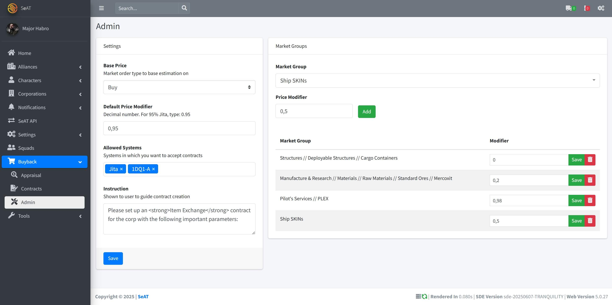
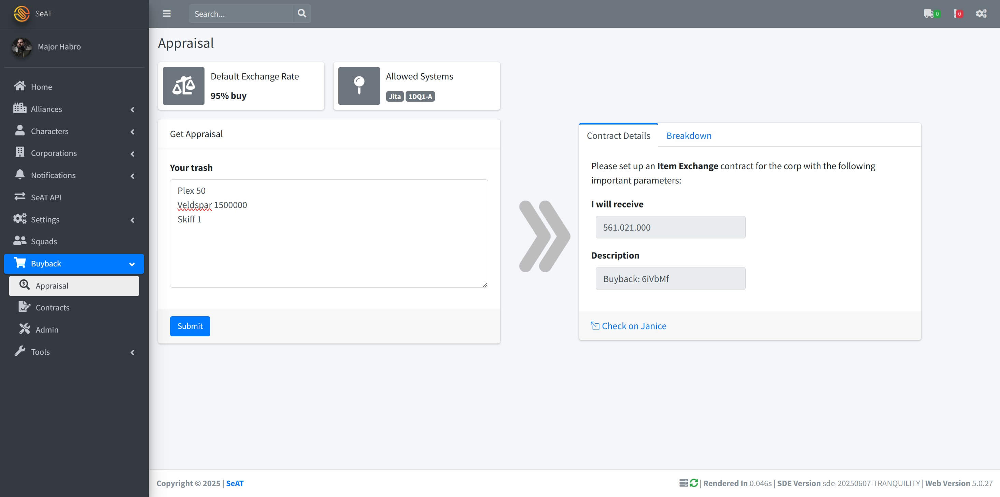

## Screenshots






## Installation

```shell
# Install the package
composer require habr0/seat-buyback

# Run the migrations
php artisan migrate

# Publish assets
php artisan vendor:publish # Select habr0/*

# Run the seeder
php artisan db:seed --class="Habr0\Buyback\Database\Seeders\BuybackSeeder"

# Clear caches
php artisan seat:cache:clear
php artisan config:cache
php artisan route:cache

```

- Add `JANICE_KEY=xxx` to your `.env` file
  - Request a proper janice API key, joining the Discord server https://janice.e-351.com/about
- Add `BUYBACK_DISCORD_HOOK=https://discord.com/api/webhooks/...` to your `.env` file
  - If you want to receive notifications of new buyback contracts to a specific channel, create a webhook and add this.

### Admin Setup

- You have two new permissions to assign to your roles:
  - buyback.view: Who's allowed to hand in buybacks / use the appraisal view.
  - buyback.admin: Who's allowed to change settings of the buyback program and see the related contracts.
- Visit the admin view `/buyback/admin` and adjust the parameters.
  - Base Price: What price should be used to work with. Default is the market `Buy` price.
  - Default Price Modifier: What (decimal) modifier should be applied to the base price. Default is 0.95, which results in 95% of the base price. 
  - Allowed Systems: In which systems will you accept buyback contracts.

Once you set these up, you're ready to start!

Example appraisal content
```
Interface Circuit	8
Capacitor Console	1
Charred Micro Circuit	2274
Tripped Power Circuit	1985
Fried Interface Circuit	2761
Melted Capacitor Console	1035
Defective Current Pump	916
Burned Logic Circuit	2117
Armor Plates	2241
Contaminated Nanite Compound	1021
Tangled Power Conduit	2218
```
